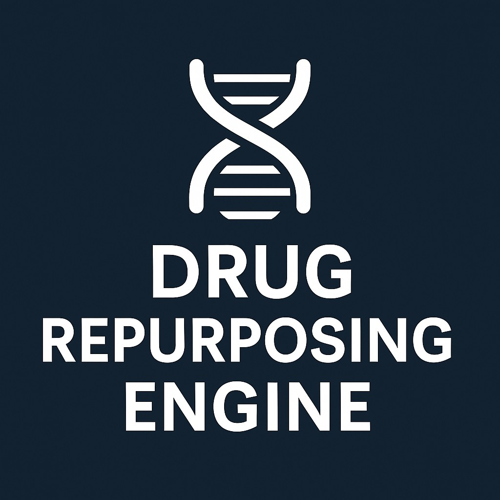

# 🧬 Drug Repurposing Engine

## *Revolutionizing Therapeutic Discovery through AI-Powered Network Science*

<p align="center">
  
</p>

<p align="center">
  <a href="#core-features"><strong>Features</strong></a> •
  <a href="#architecture"><strong>Architecture</strong></a> •
  <a href="#web-interface"><strong>Web Interface</strong></a> •
  <a href="#restful-api"><strong>API</strong></a> •
  <a href="#running-the-application"><strong>Running</strong></a> •
  <a href="#performance-optimizations"><strong>Performance</strong></a> •
  <a href="#external-data-sources"><strong>External Data</strong></a> •
  <a href="#deployment"><strong>Deployment</strong></a>
</p>

<p align="center">
  <a href="https://github.com/oluwafemidiakhoa/DrugReuseEngine">
    
  </a>
  <a href="https://drugreuseengine.com">
    
  </a>
  <a href="https://www.python.org/">
    
  </a>
  <a href="https://streamlit.io/">
    
  </a>
</p>

---

## 🔬 Overview

The **Drug Repurposing Engine** represents a cutting-edge computational platform that leverages advanced AI technologies, knowledge graph analytics, and biomedical data integration to transform the pharmaceutical discovery pipeline. By identifying new therapeutic applications for existing drugs, this platform dramatically reduces the time, cost, and risk associated with traditional drug development processes.

Drug repurposing (also known as drug repositioning) represents one of the most promising approaches to accelerate therapeutic development worldwide. By identifying new uses for existing approved drugs with established safety profiles, we can bypass early clinical trials, reducing overall development timelines by 3-5 years and cutting costs by up to 85% compared to de novo drug discovery.

This platform serves as a mission-critical tool for pharmaceutical researchers, biotechnology companies, and academic institutions seeking to leverage computational approaches to uncover hidden therapeutic potential within the existing pharmacopeia.

## 🔋 Core Features

### 🔬 Multi-Source Data Integration

The platform ingests and harmonizes data from diverse biomedical sources through its advanced integration pipelines:

- **🧬 PubMed Knowledge Mining**: Extracts structured relationships from over 34 million scientific publications using advanced NLP techniques
- **💊 Drug Information Integration**: Aggregates comprehensive drug data including mechanisms, targets, and chemical properties from authoritative sources (PubChem, RxNorm, DrugBank)
- **🩺 Disease Ontology Mapping**: Maps disease terms to standardized ontologies (UMLS, MeSH, ICD-10, SNOMED CT) for normalized analysis 
- **🔄 Real-time Data Updates**: Continuous integration with biomedical databases ensures access to the latest scientific findings
- **🌐 External Data Sources**: Integration with ChEMBL and OpenFDA databases for expanded drug coverage and cross-database verification

### 📊 Advanced Network Analytics

The knowledge graph analytics engine employs sophisticated algorithms to uncover hidden patterns:

- **🕸️ Multi-modal Knowledge Graph**: Constructs comprehensive network representations of biomedical entities and their relationships
- **🧩 Community Detection**: Identifies functionally related clusters of drugs, diseases, genes, and pathways
- **📈 Centrality Analysis**: Calculates multiple centrality metrics to identify critical nodes and potential therapeutic targets
- **🔍 Path Analysis**: Discovers indirect connections between drugs and diseases through sophisticated path-finding algorithms
- **⚡ Dynamic Graph Evolution**: Tracks the temporal evolution of the knowledge network as new data becomes available
- **🗄️ Neo4j Graph Database**: Advanced graph database integration for sophisticated relationship querying and analysis

### 🧠 AI-Powered Insight Generation

The platform leverages state-of-the-art AI models to generate detailed scientific insights:

- **🔮 Mechanistic Explanation**: Provides detailed molecular and pathway-level explanations for drug-disease relationships
- **🎯 Multi-factor Confidence Scoring**: Calculates comprehensive confidence scores for repurposing candidates based on:
  - 📚 Literature evidence strength (0-25 points)
  - 🌐 Network topology analysis (0-25 points)
  - 🧪 Molecular mechanism similarity (0-25 points)
  - 🔍 Biological plausibility assessment (0-25 points)
- **🔄 Multi-Modal LLM Integration**: Seamlessly integrates OpenAI and Hugging Face models with intelligent fallback mechanisms
- **📝 Automatic Scientific Report Generation**: Creates comprehensive research briefs for promising candidates
- **⚙️ Enhanced Performance**: Optimized for stability with batched processing and session-based caching

### 🎨 Interactive Visualization Suite

The platform features an advanced visualization system for intuitive data exploration:

- **📊 Interactive Dashboard**: Real-time metrics and KPIs for monitoring repurposing opportunities
- **🔎 Multi-dimensional Search**: Powerful query interfaces for drugs, diseases, and biological mechanisms
- **🕸️ Dynamic Network Visualization**: Interactive knowledge graph exploration with custom filtering and layouts
- **⚡ Animated Data Flow**: Revolutionary visualization of information propagation through biomedical pathways
- **📊 Scientific Visualizations**: Publication-quality charts and visualizations for research findings
- **🔬 3D Mechanism Viewer**: Stunning three-dimensional visualizations of drug-target interactions

### 🔌 Enterprise-grade API

The platform provides secure, scalable programmatic access:

- **🔐 OAuth2 Authentication**: Industry-standard JWT token-based authentication and authorization
- **📡 Comprehensive Endpoints**: Extensive API coverage for data access and analysis operations
- **⚡ Rate Limiting & Throttling**: Advanced protection against API abuse with configurable quotas
- **📖 Interactive Documentation**: Complete Swagger/OpenAPI documentation with live testing capabilities
- **🔄 Webhook Integration**: Event-driven notifications for long-running analysis tasks
- **📤 One-Click Export**: Easy export of data and visualizations to multiple formats (PDF, CSV)

## Architecture

The system consists of several core components:

1. **Data Ingestion Module** (`data_ingestion.py`): Collects data from biomedical literature and databases
2. **Knowledge Graph Module** (`knowledge_graph.py`): Constructs and analyzes network representations
3. **AI Analysis Module** (`ai_analysis.py`): Generates explanations and scores for candidates
4. **Visualization Module** (`visualization.py`): Creates interactive visualizations
5. **Web Interface** (`app.py` and `pages/`): Streamlit-based user interface
6. **API** (`api/`): RESTful API for programmatic access
7. **External Data Integration** (`external_data_integration.py`): Connects to external biomedical databases
8. **Neo4j Graph Database Integration** (`neo4j_utils.py`): Provides advanced graph database capabilities

## Web Interface

The Streamlit-based web interface provides:

- Dashboard with key metrics and insights
- Search interfaces for drugs and diseases
- Knowledge graph visualization and exploration
- Repurposing candidate analysis and evaluation
- External data source exploration
- Neo4j graph database explorer
- 3D mechanism visualizations
- Scientific visualization tools
- Global impact assessment

To access the web interface, navigate to port 5000 when the application is running.

## RESTful API

The API provides programmatic access to all platform functionality:

### Authentication

```
POST /token
```

Obtain a JWT token for API access using username and password.

### Drugs

```
GET /drugs/
GET /drugs/{drug_id}
GET /drugs/name/{drug_name}
POST /drugs/
GET /drugs/{drug_id}/pubmed
```

### Diseases

```
GET /diseases/
GET /diseases/{disease_id}
GET /diseases/name/{disease_name}
POST /diseases/
GET /diseases/{disease_id}/pubmed
```

### Knowledge Graph

```
GET /knowledge/stats
POST /knowledge/regenerate
GET /knowledge/path
GET /knowledge/centrality
GET /knowledge/repurposing
GET /knowledge/repurposing/{drug_name}/{disease_name}
```

### External Data Sources

```
GET /external/chembl/drug/{drug_name}
GET /external/openfda/drug/{drug_name}
POST /external/import
```

### Documentation

API documentation is available at:
- Swagger UI: `/docs`
- ReDoc: `/redoc`
- OpenAPI Schema: `/openapi.json`

To access the API, use port 7000 when the application is running.

## Running the Application

The application runs two servers:

1. **Streamlit Server** (Port 5000): Web interface
2. **API Server** (Port 7000): RESTful API

Both servers are managed through Replit workflows.

## Testing the API

A test script is provided to verify API functionality:

```
python test_api.py
```

This script tests authentication, authorization, and all major API endpoints.

## External Data Sources

The platform now integrates with multiple external biomedical databases:

### ChEMBL Database

ChEMBL provides access to:
- Comprehensive drug information
- Mechanism of action data
- Target binding information
- Pharmacological properties
- Clinical trial outcomes

### OpenFDA Database

OpenFDA integration offers:
- FDA-approved drug information
- Adverse event reports
- Drug labeling information
- Regulatory status updates
- Drug-drug interaction data

### Using External Data

The External Data Sources Explorer allows you to:
1. Search for drugs in both ChEMBL and OpenFDA databases
2. View detailed information from multiple sources
3. Compare data between different databases
4. Import external drugs directly into the Drug Repurposing Engine
5. Enhance existing drug information with verified external data

## Neo4j Graph Database Integration

The platform now features comprehensive Neo4j graph database integration:

### Key Benefits
- Superior representation of complex biomedical relationships
- Path discovery between drugs and diseases
- Advanced pattern recognition and centrality analysis
- Efficient similarity calculations
- Repurposing opportunity discovery through graph algorithms

### Connection Details
- The system connects to a cloud-hosted Neo4j AuraDB instance
- Fallback to in-memory graph representation when database is unavailable
- Automatic schema creation and constraint management
- Optimized Cypher queries for performance

## Adding New Data

New drugs, diseases, and relationships can be added through:

1. The web interface (Drug Search and Disease Search pages)
2. The API (`POST /drugs/` and `POST /diseases/` endpoints)
3. The External Data Sources Explorer (import from ChEMBL/OpenFDA)
4. Neo4j Graph Explorer (direct database manipulation)

## Architecture Improvements

Recent architectural improvements include:

- **Performance Optimization**: Batched processing, limited search depth, and session-based caching
- **Resilient API Connections**: Enhanced error handling with exponential backoff for external API requests
- **Modular Data Sources**: Pluggable data source architecture for easy integration of new databases
- **Graph Database Integration**: Neo4j support for advanced graph analytics capabilities
- **Enhanced Export Features**: One-click export of data and visualizations to multiple formats

## Interactive Data Flow Visualization

The platform includes an advanced animated data flow visualization system that demonstrates how information flows through the knowledge graph. This feature:

- Shows the propagation of information from drugs to diseases (or vice versa)
- Animates the flow of data along network paths
- Highlights active edges during data transmission
- Provides customization options for animation speed and pulse count
- Can be filtered to focus on specific starting nodes

This visualization helps researchers understand the indirect connections between drugs and diseases, making it easier to identify potential repurposing opportunities and understand the underlying biological pathways.

## How It Works Page

The platform includes a dedicated "How It Works" page that provides a comprehensive explanation of the system's functionality:

- Data Flow: Visualizes and explains the 8-step process from data collection to result presentation
- Confidence Scoring: Details how confidence scores are calculated using multiple components
- Knowledge Graph: Explains node types, edge types, and demonstrates a sample subgraph

This page serves as educational documentation for users to understand the underlying mechanisms of the drug repurposing engine.

## 🌐 Global Impact Assessment

The Drug Repurposing Engine provides comprehensive global impact assessment tools to help researchers, pharmaceutical companies, and public health organizations understand the worldwide implications of drug repurposing efforts:

- **🗺️ Geographic Impact Analysis**: Visualizes the potential impact of repurposed drugs across different regions and countries
- **💰 Economic Impact Modeling**: Estimates cost savings and economic benefits of repurposed drugs compared to de novo drug development
- **👥 Patient Population Analysis**: Identifies patient populations who could benefit from repurposed therapies
- **⏱️ Time-to-Market Projection**: Calculates accelerated development timelines for repurposed drugs
- **🔄 Comparative Clinical Analysis**: Compares clinical efficacy and safety profiles between original and new indications
- **⚖️ Regulatory Pathway Assessment**: Evaluates regulatory hurdles and approval pathways for repurposed drugs
- **🏥 Healthcare System Integration**: Analyzes integration challenges and opportunities within existing healthcare systems

## 🔮 Future Development Roadmap

The platform is continually evolving with planned enhancements including:

### 🧠 Advanced AI Capabilities
- **🔄 Federated Learning Integration**: Distributed model training across multiple research institutions without sharing sensitive data
- **🧩 Multi-Omics Data Integration**: Incorporation of genomics, proteomics, transcriptomics, and metabolomics data layers
- **🧪 In Silico Validation Pipeline**: Virtual validation of repurposing candidates through computational models
- **🔬 Molecular Docking Simulation**: 3D protein-drug interaction simulations for binding affinity prediction
- **🧬 Pathway-Level Abstraction**: Higher-level analysis of biological pathways rather than individual molecular interactions
- **🤖 xAI Integration**: Adding support for xAI's Grok models for additional AI capabilities

### 📊 Enhanced Analytics
- **⏱️ Temporal Knowledge Graph Analysis**: Track the evolution of biomedical knowledge and relationships over time
- **🧮 Causal Inference Modeling**: Advanced statistical methods to identify causal relationships in biomedical data
- **🌐 Cross-Species Translation**: Extend analysis to include animal model data for translational insights
- **🧪 Clinical Trial Outcome Prediction**: ML models to forecast success rates of repurposing candidates in clinical trials
- **⚠️ Adverse Event Prediction**: Predictive models for potential side effects in new therapeutic contexts

### 🔌 System Capabilities
- **☁️ Cloud-Native Architecture**: Fully distributed cloud infrastructure for improved scalability and resilience
- **📱 Mobile Application Interface**: Extend platform access to mobile devices for on-the-go analysis
- **🔄 Real-time Data Processing**: Stream processing of new biomedical literature and research findings
- **🔒 Enhanced Security Features**: Advanced encryption and access controls for sensitive biomedical data
- **🌐 Collaborative Workspaces**: Multi-user collaborative environments for research teams
- **📄 Comprehensive Reporting**: Enhanced PDF report generation with interactive elements

## 🚀 Performance Optimizations

The Drug Repurposing Engine implements extensive performance optimizations to ensure responsive user experience even with large datasets:

### 📈 Progressive Loading Framework
- **⏱️ Immediate UI Rendering**: Separates data loading from UI rendering for instant responsiveness
- **🔄 Background Data Processing**: Heavy computations run asynchronously without blocking UI
- **📦 Fallback Data Strategy**: Curated sample datasets ensure functionality when database connections fail
- **📊 Data Prioritization**: Critical data is loaded first, with secondary data following progressively

### 🗄️ Advanced Caching System
- **💾 Session-Based Caching**: Stores computation results during user sessions to avoid redundant processing
- **📂 Persistent File Caching**: Long-term storage of expensive computations with configurable timeouts
- **🔑 Intelligent Cache Invalidation**: Selective cache clearing when underlying data changes
- **📦 Serialization Optimization**: Efficient data serialization for minimal storage footprint

### 🔄 Database Optimizations
- **🌐 Connection Pooling**: Neo4j connection pooling for efficient database access
- **🔍 Query Optimization**: Fine-tuned Cypher queries with performance profiling
- **📊 Indexed Properties**: Strategic database indexing for rapid lookups
- **🔢 Batched Processing**: Data handling in optimized batch sizes to prevent memory issues

### 📱 User Interface Enhancements
- **🎛️ Detail Level Controls**: User-selectable visualization density (Standard/Enhanced/Complete)
- **📊 Optimized Visualizations**: Replaced complex visualizations with more performant alternatives
- **🔄 Lazy Loading Components**: Components load only when needed and visible to user
- **📱 Responsive Design**: Adapts to different screen sizes and device capabilities

## 🚀 Deployment

The Drug Repurposing Engine is deployed and accessible through multiple channels:

### 🌐 Replit Deployment
- **🔗 Custom Domain**: Available at [drugreuseengine.com](https://drugreuseengine.com)
- **🔄 Continuous Deployment**: Automatic updates when code changes are pushed
- **🔌 Multiple Servers**: Separate Streamlit UI (port 5000) and API (port 7000) servers
- **📊 Environment Configuration**: Configured for optimal performance in Replit environment

### 📦 GitHub Repository
- **💻 Source Code Access**: Full codebase available at [GitHub](https://github.com/oluwafemidiakhoa/DrugReuseEngine)
- **📚 Documentation**: Comprehensive setup and usage documentation
- **🛠️ Self-Hosting Instructions**: Detailed deployment guides for local and cloud environments
- **📋 Issue Tracking**: Platform for reporting bugs and requesting features

### ☁️ Streamlit Cloud (Optional)
- **🌐 Additional Hosting Option**: Can be deployed to Streamlit's cloud platform
- **🔐 GitHub Integration**: Direct deployment from GitHub repository
- **📊 Usage Analytics**: Performance and user interaction tracking
- **🚫 No Infrastructure Management**: Fully managed deployment environment

### 📃 Deployment Documentation
- **🔧 Installation Guide**: Step-by-step setup instructions
- **⚙️ Configuration Options**: Customization parameters for different environments
- **🌐 API Documentation**: Complete API reference with examples
- **📋 Environment Variables**: List of required secrets and configuration variables
- **📊 Monitoring Setup**: Instructions for performance and error monitoring

## 🔄 Recent Updates

The Drug Repurposing Engine has received several important enhancements:

### 📊 Visualization Improvements
- **📊 Pathway Visualization**: Replaced complex Sunburst chart with more reliable horizontal bar chart
- **🏷️ Component Labels**: Removed redundant component type labels to reduce visual clutter
- **📈 Temporal Analysis**: Modified to overlay timeline annotations directly on charts with improved styling
- **🎨 Consistent Styling**: Standardized colors and design elements across all visualizations
- **⚙️ Detail Level Selection**: Added dropdown to adjust visualization density (Standard/Enhanced/Complete)

### 🚀 Performance Enhancements
- **🔄 Neo4j Connection Pooling**: Implemented connection reuse for faster database access
- **📦 Progressive Loading**: Added framework for background loading of heavy data
- **💾 Persistent Caching**: Created filesystem-based cache with configurable timeouts
- **🔢 Batch Processing**: Implemented batched data handling to prevent memory issues
- **🔍 Query Optimization**: Refined database queries for faster response times

### 📚 Documentation & Deployment
- **📗 GitHub Repository**: Set up code repository at [github.com/oluwafemidiakhoa/DrugReuseEngine](https://github.com/oluwafemidiakhoa/DrugReuseEngine)
- **🌐 Custom Domain**: Configured custom domain at [drugreuseengine.com](https://drugreuseengine.com)
- **📝 Export Guides**: Added comprehensive instructions for manual code export
- **📋 README Updates**: Extensively documented system architecture and capabilities

### 🔌 API Enhancements
- **⚡ Error Handling**: Improved resilience with exponential backoff for external API requests
- **📚 Documentation**: Enhanced API documentation with examples and usage guidelines
- **🔄 Rate Limiting**: Implemented configurable rate limiting to prevent API abuse
- **🔒 Security Updates**: Strengthened authentication and authorization mechanisms